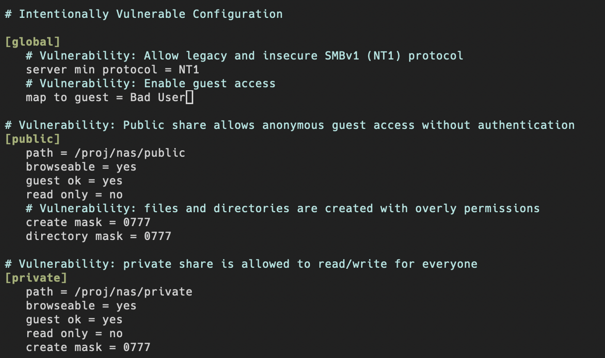
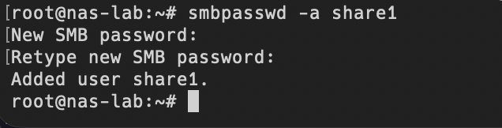
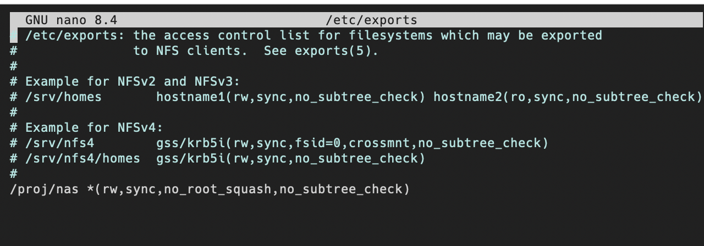
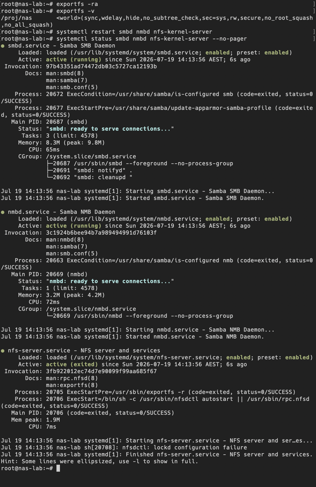
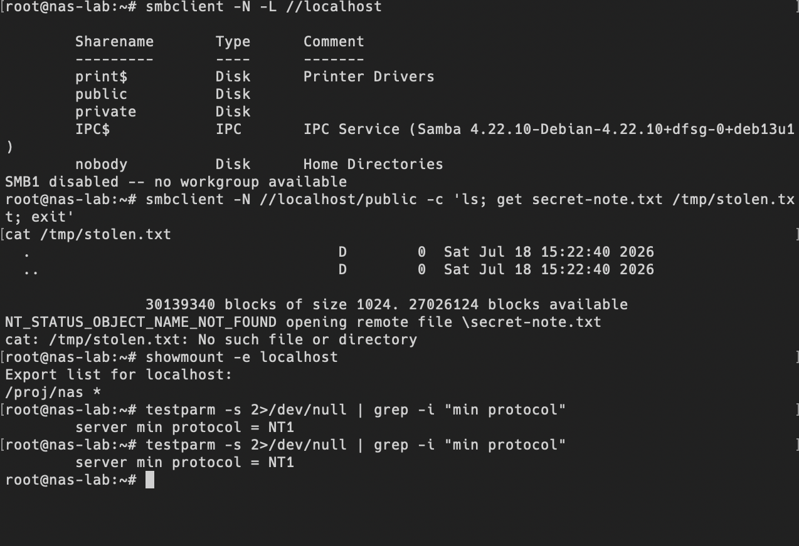

write vulnerabilities:

mainly anonymous guest access, Weak authentication, Overly permissive file permissions, outdated SMBv1 (NT1) protocol

add smb user share1,
also with a weak password: `password123`

改 /etc/exports：/proj/nas 导出给 *，rw + no_root_squash

重启服务

验证
