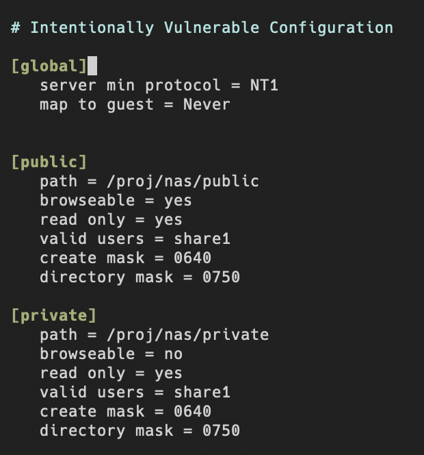
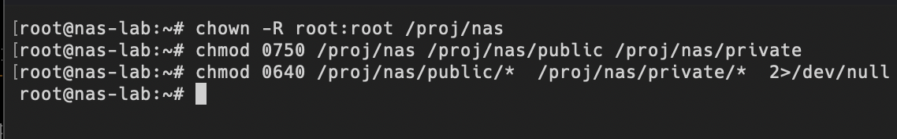
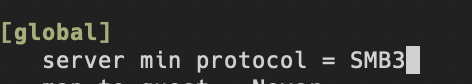
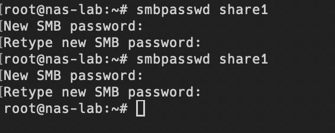
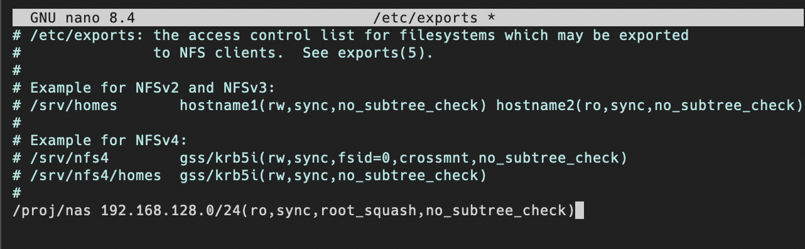
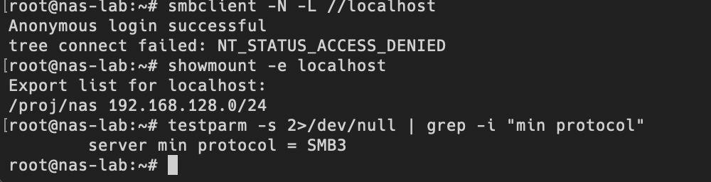

# hardening

## 隐患 A — 关闭匿名 / guest 访问，强制认证 和 隐患 D — 收紧共享权限到最小必要(Least Privilege)

`[global]`段
map to guest = Baduser
改成
map to guest = Never

`[public]` 和 `[private]` 段
1. 删除guest ok = yes
这样改好之后，没有有效的samba账户的连接会被拒绝，匿名不可访问。
2. read only 改成yes：默认只读
3. create mask = 0640， directory mask = 0750
新建文件不再人人可读写。
4. private 段 browsable = no，不再列表里暴露敏感共享。

收回目录本身的过宽权限

原则：Secure by Default + Least Privilege

## 隐患 E — 禁用 SMBv1，只留 SMB3
Attack Surface Reduction

SMB3强制客户端用SMB3及以上。

### 隐患 B — 强密码

新密码改成了：Nas!Lab_2026#Str0ng

## 隐患 F — NFS 限定网段

按实际的 Host-Only 网段限制
客户端root被降级成nobody，不能再以root越权写入。
rw改成ro，默认只读

# 最终确认

