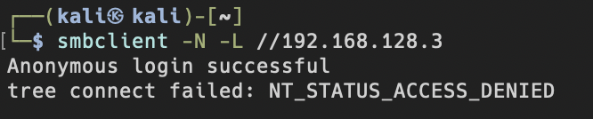
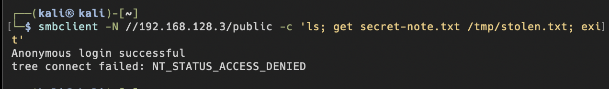
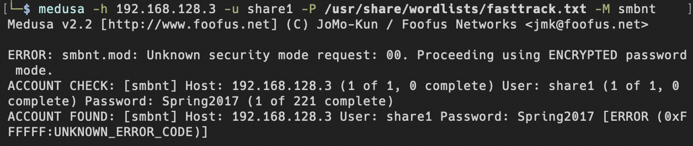
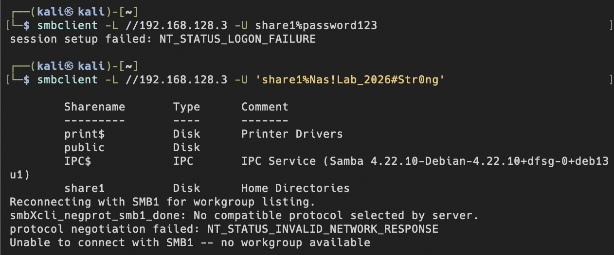
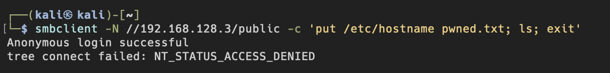
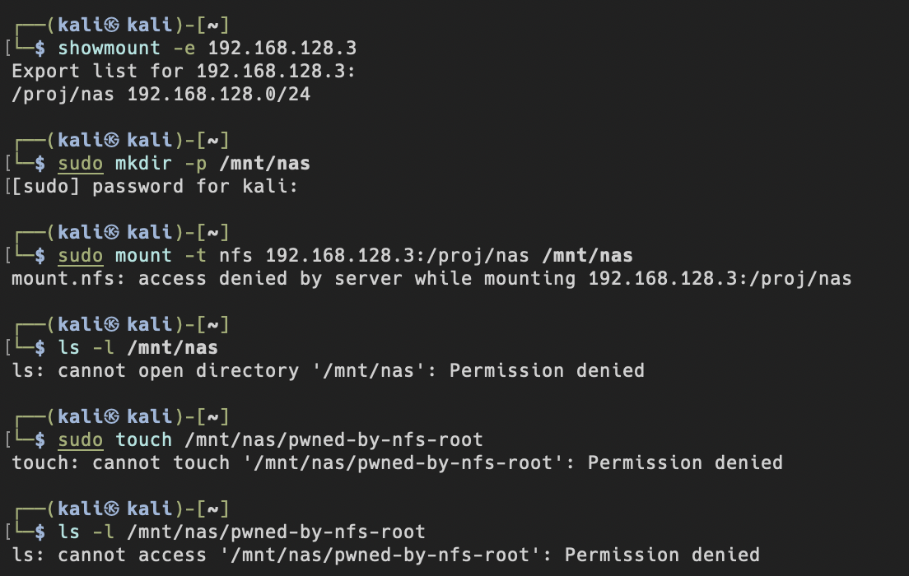
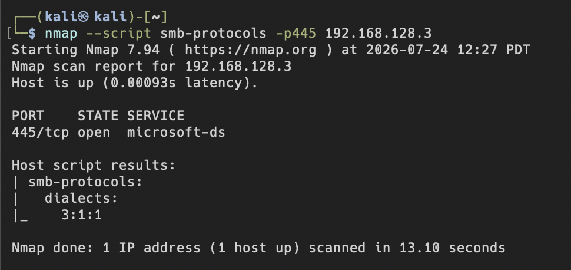

# reassessment

## A — 匿名 SMB 访问

无密码列出共享的指令被拒绝

## B — 弱口令爆破
之前poc用 medusa 爆出弱口令 `password123`（第 82 个词 `[SUCCESS]`）。加固已把 share1 口令换成强口令 `Nas!Lab_2026#Str0ng`。

### challenge
reassessment本应用同一条 medusa 命令复跑，但 medusa 的 smbnt 模块对"全部失败"场景有返回码解析缺陷（第 1 个密码就误报 `[ERROR: UNKNOWN_ERROR_CODE]` 并中止）。

因此改用 smbclient 直接验证旧凭据是否还能登录。

强密码理论上不容易出现在wordlist里，不易被强行爆破，安全性提高。

## D — 过宽共享权限
加固后匿名完全连不进，即便合法账户，read only = yes 也会组织写入（least priviledge）

## F — NFS 越权挂载

`showmount -e` 现在显示导出限定到 `192.168.128.0/24`，不再是 `*`。

后面的读、写全部 Permission denied。

## E — SMBv1(NT1) 老旧协议应不再支持

