2个机器互通，同时连接不到外部网络：
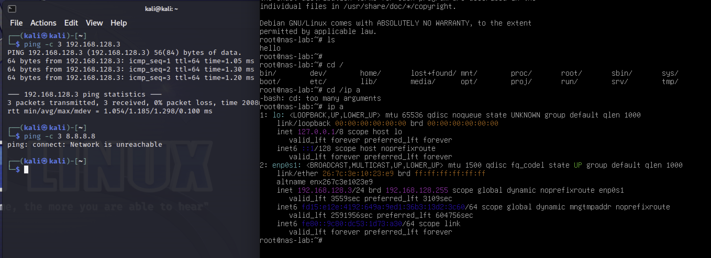

kali nmap 扫描服务版本
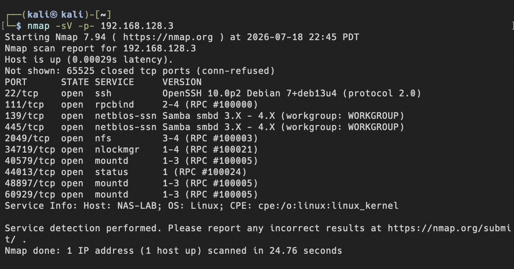

# PoC攻击

## 隐患 A — 匿名 SMB 访问
无密码列共享
-N 无密码
-L 列共享
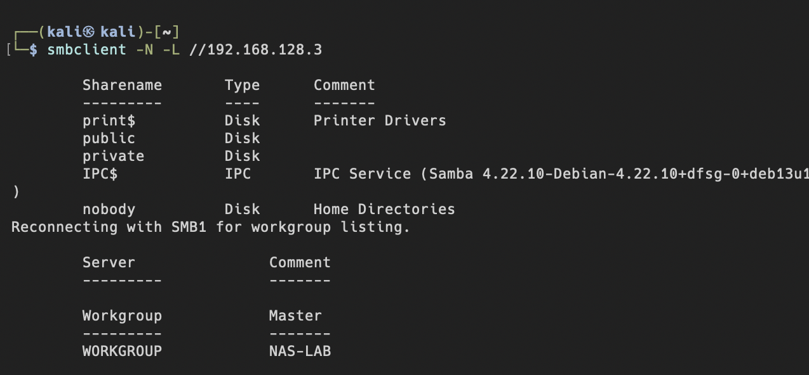

匿名连入public，读取txt
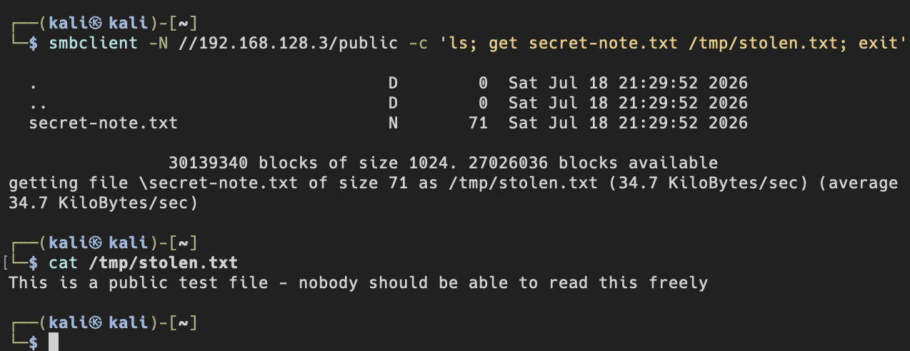

## 隐患 B — 弱口令爆破（medusa）

确认Kali字典存在 rockyou
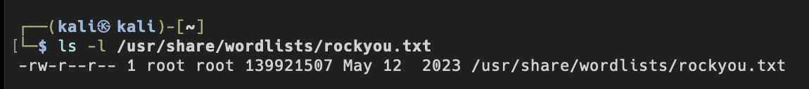

在靶机上我们可以确认 share1的密码是password123
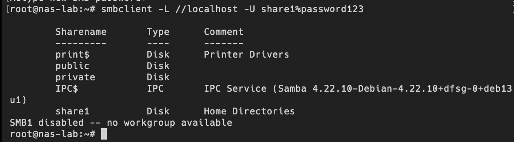

### challenge：
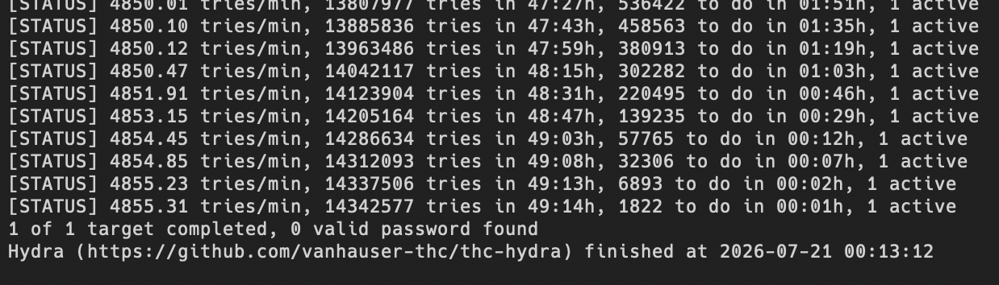
从图中可以看到，我是用hydra完整的跑了49个小时的rockyou.txt，但是结果是0 valid password found。
有两个问题：
1. rockyou有1434万条，太长，而且我对kali虚拟机的限制是单线程。对于password123这种弱密码，该换小字典fasttrack.txt
2. 改换fasttrack.txt之后，这次秒出结果，还是0 valid password found。原因是hydra的smb模块与samba协议不兼容，改用medusa成功爆破命中password123
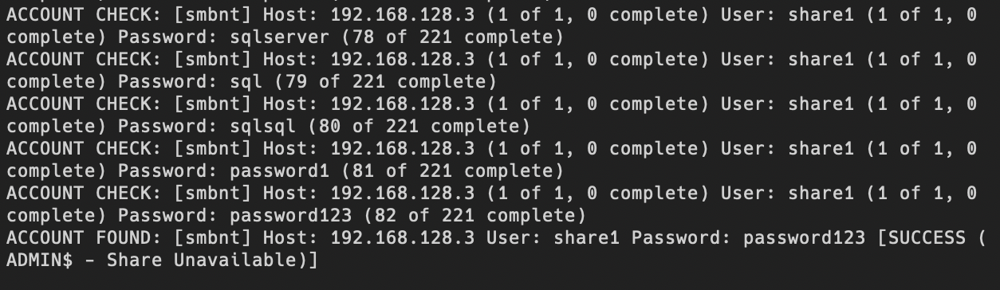
medusa 试到第 82 个词 `password123` 命中，结尾 `[SUCCESS (ADMIN$ - Share Unavailable)]` —— before 弱口令确实可被爆破。

## 隐患 D — 过宽共享权限（匿名写入）

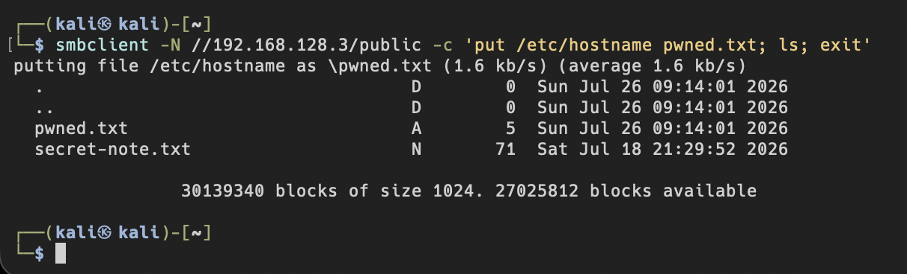
-N 无任何验证，put一个文件进入目录，执行ls显示写入成功。证明过宽的权限。

## 隐患 E — SMBv1(NT1) 老旧协议探测
NT LM 0.12 (SMBv1)出现在服务端支持的 dialects 列表里,甚至被[dangerous, but default]
这证明 NAS 服务端仍接受已被弃用的 SMBv1 协议

## 隐患 F — NFS 无限制挂载（no_root_squash 越权）
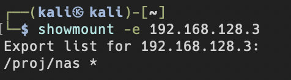
1. /proj/nas 这个目录导出给了任何ip。（没有网段限制，谁都能挂载）。
2. 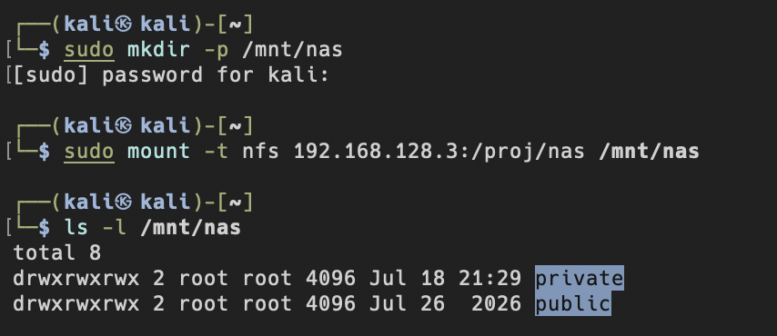
在kali本地建目录，把远程nfs挂到本地。列出刮进来的内容，可以看到private和public两个目录。

无认证就可以挂在成功。`drwxrwxrwx`也同时印证过宽权限。attacker能读到不该暴露的private目录。

3. 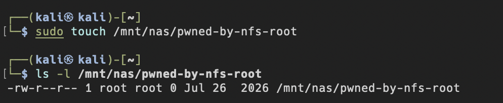
在挂载点以root身份创建了一个文件， ls -l之后可以看到，文件的owner是root root。
因为 /etc/exports 里配了 no_root_squash,Kali 客户端的 root 直接被当成服务端的 root 来写文件。
攻击者以 root 身份在 NAS上创建文件。正常安全配置(root_squash)会把客户端 root 降级成 nobody，写出来的文件 owner 会是 nobody 而非 root。

这代表攻击者可以往 NAS 的任意位置（系统关建目录）以最高权限写入,等于拿下整台机器。

