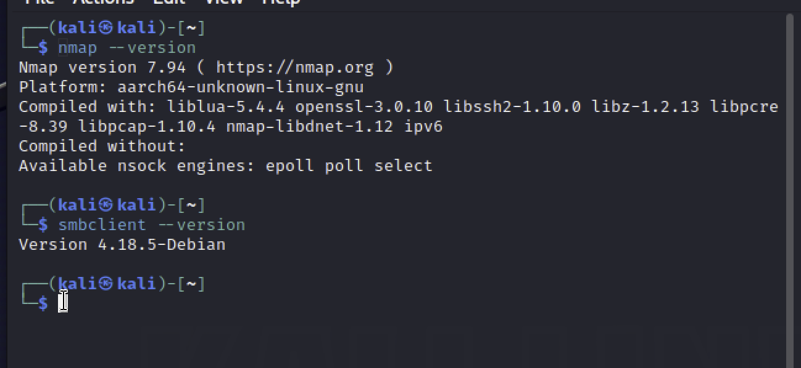
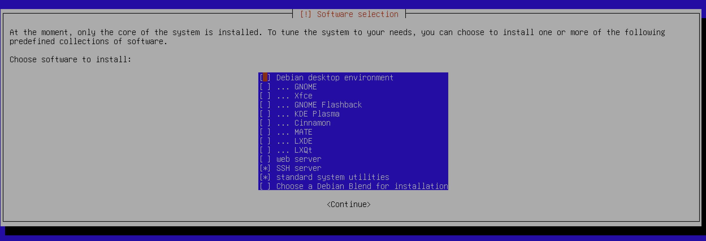
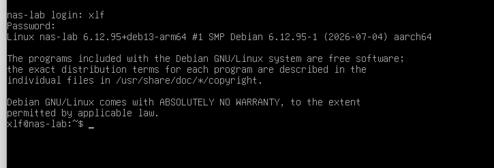
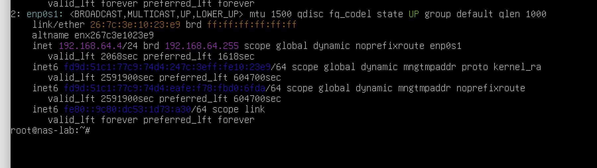
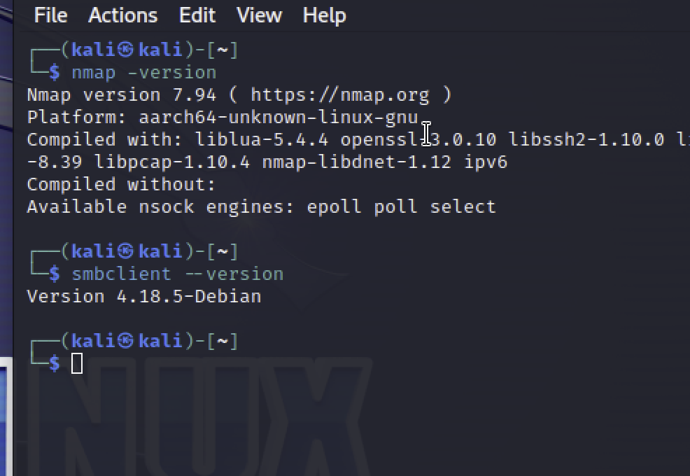

brew install --cask utm

### nas-lab
domain name: 
root password: 1234
full name of new user: xlf
username for your account： xlf
password for new user: 1234

成功登陆：

内网ip

### kali 攻击机
核心工具 都在

 challenge:
1. 安装debian linux的时候碰到了一些困难，好在有video可以一步步按部就班的照做。

